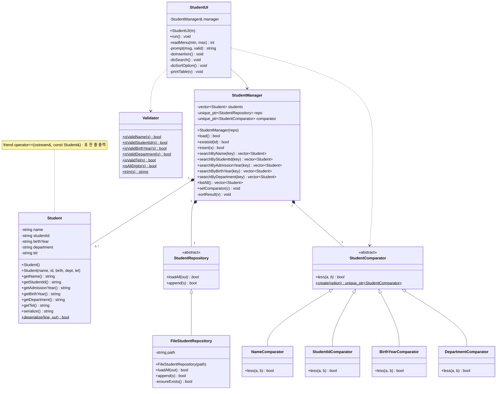
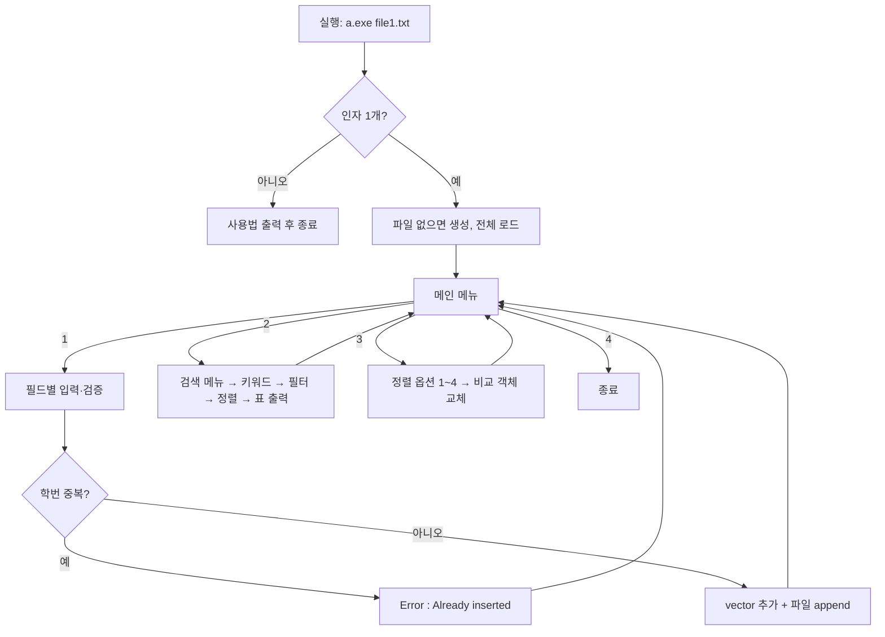

<aside>
📌

담당: 조민규 (~09/25) · **Prob#2** · 마감: 10/11 (일) 23:59

</aside>

## 0. 팀 일정

| 단계 | 담당 | 기한 |
| --- | --- | --- |
| 1. 요구사항 정의 및 설계 | 조민규 | ~09/25 |
| 2. 개발 및 데모 비디오 촬영 | 손건영, 유금진 | ~10/02 |
| 3. 보고서 작성 (영어) | 도현서 | ~10/06 |
| 4. 최종 제출 및 발표 자료 (영어) | 신지후 | ~10/09 |

제출 관련:

- 신지후가 eClass에 제출: 소스코드, 데모 영상(.mp4, 1~2분), 보고서
- 발표는 신지후

---

## 1. 기능 요구사항 (FR)

| ID | 요구사항 | 비고 |
| --- | --- | --- |
| FR-01 | 실행: `a.exe file1.txt`. 인자로 파일 1개를 받음 | 인자 없으면 사용법 출력 후 종료 |
| FR-02 | 파일이 없으면 새로 만들고, 있으면 기존 데이터를 읽어옴 |  |
| FR-03 | 메인 메뉴: `1. Insertion` / `2. Search` / `3. Sorting Option` / `4. Exit` | 각 작업 후 메인 메뉴로 돌아감 |
| FR-04 | Insertion: Name, Student ID, Birth Year, Department, Tel 순으로 입력받아 파일에 저장 | 프롬프트 문구는 스펙과 똑같이 |
| FR-05 | 학번이 중복되면 `Error : Already inserted` 출력 | 문구 그대로 출력 |
| FR-06 | Search 메뉴 1~6: 이름, 학번, 입학년도, 출생년도, 학과, List All | 결과는 현재 정렬 옵션 순서로 출력 |
| FR-07 | Sorting Option 1~4: 이름, 학번, 출생년도, 학과 | 기본값은 이름순 |
| FR-08 | 프로그램을 종료해도 데이터가 유지되어야 함 (파일 입출력) | C++ 표준 라이브러리 + STL만 사용 |
| FR-09 | 삭제 기능은 없음 |  |

## 2. 비기능 요구사항 (NFR)

- 외부 라이브러리는 쓰지 않음. 헤더는 `<fstream>`, `<string>`, `<vector>`, `<algorithm>`, `<iomanip>`, `<memory>` 정도면 충분함 (`std::make_unique`를 쓰니까 **C++14 이상** 필요)
- 컴파일과 실행이 꼭 돼야 함. 채점에서 제일 중요하게 보는 부분
- 효율성은 채점하지 않음. 구조는 단순하게 가고, 정확하게 동작하는 데 집중
- 빌드는 Visual Studio `.sln`과 g++ + `Makefile` 중에서 고름
- `README.txt`에는 OS, 컴파일러 버전, 빌드·실행 방법을 적음

---

## 3. 입력 검증 규칙

| 필드 | 규칙 | 필수 여부 |
| --- | --- | --- |
| Name | 영문 최대 15자 (공백 허용: "Lisa Simpson") | **필수** (비어 있으면 안 됨) |
| Student ID | 숫자로만 정확히 10자리. 앞 4자리가 입학년도 | **필수**, 중복 불가 |
| Birth Year | 숫자로만 정확히 4자리 | 필수 (결정 사항 D3 참고) |
| Department | 공백 허용 ("Computer Engineering") | 선택 |
| Tel | 숫자로만 최대 12자리. 앞자리 0이 있으니 **string으로 저장** | 선택 |

공통 규칙:

- 입력값 앞뒤 공백은 잘라냄(trim)
- `|`가 들어간 입력은 받지 않음. 파일 구분자라서 섞이면 포맷이 깨짐
- 형식이 틀리면 에러 메시지를 보여주고 **해당 필드만 다시 물어봄**

## 4. 엣지 케이스 체크리스트(필요하면 쓰세용)

- [ ]  메뉴에 숫자가 아닌 값을 넣을 때 (`abc`, 빈 줄, `7`, `0`) → "Invalid input" 출력 후 메뉴 다시 표시
- [ ]  입력 버퍼 문제 해결: `cin >>`과 `getline`을 섞어 쓰지 말고 **전부 `getline`으로** 받음
- [ ]  EOF(Ctrl+D / Ctrl+Z)가 들어오면 무한 루프에 빠지지 않고 안전하게 종료
- [ ]  파일은 있는데 비어 있을 때 → 레코드 0개로 정상 동작
- [ ]  파일에 형식이 깨진 줄이 있을 때 → **경고 출력 후** 그 줄만 건너뛰고 나머지는 읽음
- [ ]  파일에 같은 학번 줄이 여러 개 있을 때 → 먼저 나온 줄만 올리고, 뒤에 나온 줄은 경고 출력 후 건너뜀 (파일은 수정 안 함, D8 참고)
- [ ]  Windows 줄바꿈 `\r\n` → 읽을 때 끝의 `\r` 제거
- [ ]  이름이 정확히 15자일 때는 허용, 16자면 거부
- [ ]  학번 9자리, 11자리, 영문이 섞인 경우 → 거부
- [ ]  이미 파일에 있는 학번을 다시 넣을 때 (재실행 후 포함) → `Error : Already inserted`
- [ ]  검색 결과가 0건일 때 → 헤더만 출력하거나 "No results" 출력 (D4 참고)
- [ ]  정렬 기준 값이 같은 경우 (동명이인 등) → 2차 정렬을 학번으로 해서 순서를 항상 같게 유지
- [ ]  레코드가 0명일 때 List All 실행

---

## 5. 데이터 파일 포맷 (file1.txt)

한 줄에 학생 1명, 필드 구분자는 `|`:

```
Name|StudentID|BirthYear|Department|Tel
Lisa Simpson|2006303001|2000|Computer Engineering|01012345678
Gildong Hong|2004303077|1999|Computer Engineering|01187651234
```

- 파일 맨 위에 헤더 줄은 안 둠. 두면 읽을 때 그 줄을 따로 건너뛰어야 함
- `|`를 구분자로 고른 이유: Name, Department 안에 공백이 있을 수 있어서 공백·탭 기준으로는 필드를 제대로 못 나눔
- 저장은 Insertion에 성공한 순간 **바로 append하고 flush**함. 프로그램이 중간에 죽어도 그때까지 넣은 데이터는 남음

---

## 6. 클래스 설계

### 6.0 OOP 원칙 적용 요약

| 원칙 | 어디에 적용했나 | 효과 |
| --- | --- | --- |
| 캡슐화 | `Student` 필드는 전부 private, getter만 제공 | 저장된 레코드를 밖에서 바꿀 수 없음 (삭제·수정 없는 스펙과 일치) |
| 추상화 | `StudentRepository` 추상 클래스 | `StudentManager`는 데이터가 파일에 저장되는지 몰라도 됨 |
| 상속 | `FileStudentRepository`, 비교 클래스 4개 | 공통 인터페이스를 상속받아 구현 |
| 다형성 (Strategy 패턴) | `StudentComparator`의 가상 함수 `less()` | 정렬 옵션을 바꾸면 비교 객체만 교체됨. 정렬 코드는 그대로 |
| 팩토리 메서드 | `StudentComparator::create(option)` | 메뉴 번호를 받아 맞는 비교 객체를 만들어 줌 |
| 연산자 오버로딩 | `operator<<(ostream&, const Student&)` | `std::cout << student;`로 표 한 줄 출력 |
| 단일 책임 | UI / 로직 / 저장 / 검증 / 정렬을 클래스별로 분리 | 개발자 2명이 파일 단위로 나눠서 작업하기 쉬움 |

### UML 클래스 다이어그램



기호: `<|--` 상속, `*--` 합성(소유), `-->` 연관, `..>` 의존, `*` 순수 가상 함수, `$` static, `+` public, `-` private (노란 메모: friend 함수)

### 6.1 Student — 학생 레코드 하나

```cpp
class Student {
private:
    std::string name;        // up to 15 chars
    std::string studentId;   // exactly 10 digits
    std::string birthYear;   // exactly 4 digits
    std::string department;  // may contain spaces
    std::string tel;         // up to 12 digits (string: leading 0)
public:
    Student();
    Student(const std::string& name, const std::string& id,
            const std::string& birth, const std::string& dept,
            const std::string& tel);

    const std::string& getName() const;
    const std::string& getStudentId() const;
    std::string getAdmissionYear() const;   // studentId.substr(0, 4)
    const std::string& getBirthYear() const;
    const std::string& getDepartment() const;
    const std::string& getTel() const;

    std::string serialize() const;                          // -> "a|b|c|d|e"
    static bool deserialize(const std::string& line, Student& out); // false if malformed

    // prints one table row with std::left + std::setw (see section 8)
    friend std::ostream& operator<<(std::ostream& os, const Student& s);
};
```

### 6.2 Validator — 입력 검증 (static 함수만 모아둔 클래스)

```cpp
class Validator {
public:
    static bool isValidName(const std::string& s);       // 1~15, no '|'
    static bool isValidStudentId(const std::string& s);  // 10 digits
    static bool isValidBirthYear(const std::string& s);  // 4 digits
    static bool isValidDepartment(const std::string& s); // no '|'
    static bool isValidTel(const std::string& s);        // 0~12 digits
    static bool isAllDigits(const std::string& s);
    static std::string trim(const std::string& s);
};
```

### 6.3 StudentRepository / FileStudentRepository — 저장소 (추상화 + 상속)

```cpp
// Abstract storage: StudentManager depends only on this interface
class StudentRepository {
public:
    virtual ~StudentRepository() = default;
    virtual bool loadAll(std::vector<Student>& out) = 0;  // read every stored record
    virtual bool append(const Student& s) = 0;            // persist one new record
};

// Concrete storage: one student per line in a text file ('|' separated)
class FileStudentRepository : public StudentRepository {
private:
    std::string path;
    bool ensureExists();                                  // create file if missing
public:
    explicit FileStudentRepository(const std::string& path);
    // skip malformed lines and duplicate-ID lines (keep the first one), print a warning for each
    bool loadAll(std::vector<Student>& out) override;
    bool append(const Student& s) override;               // append + flush
};
```

### 6.4 StudentComparator — 정렬 기준 (다형성, Strategy 패턴)

```cpp
// Abstract sort strategy: compares only the primary key
class StudentComparator {
public:
    virtual ~StudentComparator() = default;
    virtual bool less(const Student& a, const Student& b) const = 0;

    // Factory: 1=Name, 2=Student ID, 3=Birth Year, 4=Department (nullptr if invalid)
    static std::unique_ptr<StudentComparator> create(int option);
};

class NameComparator : public StudentComparator {
public:
    bool less(const Student& a, const Student& b) const override; // case-insensitive
};
class StudentIdComparator : public StudentComparator {
public:
    bool less(const Student& a, const Student& b) const override;
};
class BirthYearComparator : public StudentComparator {
public:
    bool less(const Student& a, const Student& b) const override;
};
class DepartmentComparator : public StudentComparator {
public:
    bool less(const Student& a, const Student& b) const override; // case-insensitive
};
```

### 6.5 StudentManager — 핵심 로직 (UI 코드 없음)

```cpp
class StudentManager {
private:
    std::vector<Student> students;
    std::unique_ptr<StudentRepository> repo;         // owns the storage
    std::unique_ptr<StudentComparator> comparator;   // default: NameComparator
public:
    explicit StudentManager(std::unique_ptr<StudentRepository> repo);
    bool load();

    bool existsId(const std::string& id) const;
    bool insert(const Student& s);     // false if duplicate ID

    std::vector<Student> searchByName(const std::string& key) const;
    std::vector<Student> searchByStudentId(const std::string& key) const;
    std::vector<Student> searchByAdmissionYear(const std::string& key) const;
    std::vector<Student> searchByBirthYear(const std::string& key) const;
    std::vector<Student> searchByDepartment(const std::string& key) const;
    std::vector<Student> listAll() const;

    void setComparator(std::unique_ptr<StudentComparator> c);  // swap sort strategy
private:
    // std::stable_sort using comparator->less(); ties broken by studentId
    void sortResult(std::vector<Student>& v) const;
};
```

### 6.6 StudentUI — 콘솔 입출력 전담

```cpp
class StudentUI {
private:
    StudentManager& manager;
public:
    explicit StudentUI(StudentManager& m);
    void run();                       // main loop
private:
    int  readMenu(int min, int max);  // getline + validate
    std::string prompt(const std::string& msg, bool (*valid)(const std::string&));
    void doInsertion();
    void doSearch();
    void doSortOption();   // StudentComparator::create(n) -> manager.setComparator(...)
    void printTable(const std::vector<Student>& v) const;  // header + std::cout << s
};
```

### 6.7 main.cpp

```cpp
int main(int argc, char* argv[]) {
    if (argc != 2) { std::cerr << "Usage: " << argv[0] << " file1.txt\n"; return 1; }
    StudentManager manager(std::make_unique<FileStudentRepository>(argv[1]));
    if (!manager.load()) { std::cerr << "Cannot open file\n"; return 1; }
    StudentUI(manager).run();
    return 0;
}
```

### 6.8 파일 구성

```
prob2/
├── main.cpp
├── Student.h / Student.cpp
├── Validator.h / Validator.cpp
├── StudentRepository.h                      (interface only)
├── FileStudentRepository.h / FileStudentRepository.cpp
├── StudentComparator.h / StudentComparator.cpp  (4 subclasses + create)
├── StudentManager.h / StudentManager.cpp
├── StudentUI.h / StudentUI.cpp
├── Makefile (or .sln)
├── file1.txt
└── README.txt
```

---

## 7. 동작 흐름



## 8. 출력 포맷

`operator<<` 안에서 `std::left` + `std::setw`로 열 너비 고정:

| 열 | Name | StudentID | Dept | Birth Year | Tel |
| --- | --- | --- | --- | --- | --- |
| 너비 | 16 | 11 | 24 | 11 | 12 |

```
Name            StudentID  Dept                    Birth Year Tel
Lisa Simpson    2006303001 Computer Engineering    2000       01012345678
```

---

## 9. 결정 사항 (스펙에 명시되지 않은 부분 — 팀 확인 필요)

| # | 항목 | 제안 |
| --- | --- | --- |
| D1 | 이름/학과 검색 방식 | **부분 일치 + 대소문자 구분 없음** (스펙에서 학과는 "keyword"라고 함). 학번·입학년도·출생년도는 **완전 일치** |
| D2 | 정렬 옵션 유지 범위 | 실행 중에만 유지. 재실행하면 기본값(이름순)으로 돌아감 |
| D3 | Birth Year 필수 여부 | **필수로 처리.** 스펙에서 "비어 있으면 안 됨"은 Name·Student ID에만 있지만, ① "정확히 4자리(exactly 4 digits)" 조건을 빈 값은 만족하지 못하고 ② Sort by Birth Year의 정렬 기준이라 빈 값이 있으면 어디에 둔지 규칙을 따로 정해야 하고 ③ 출생년도 검색에서도 빠지게 됨. 보고서·발표에서 설계 결정으로 언급할 것. Dept/Tel은 빈 값 허용 |
| D4 | 검색 결과 0건 | `No matching student.` 출력 |
| D5 | 잘못 입력했을 때 | 해당 필드만 다시 입력받음 (메인 메뉴로 돌아가지 않음) |
| D6 | 이름에 넣을 수 있는 문자 | 영문 + 공백만 허용? 아니면 제한 없이 15자만 체크? → **15자 제한 + `|` 금지**만 적용하는 걸 제안 |
| D7 | 정렬 시 대소문자 | 이름/학과는 대소문자 구분 없이 비교 |
| D8 | 파일에 중복 학번 줄이 있을 때 | **먼저 나온 줄만 살리고 뒤에 나온 줄은 건너뜀.** 실행 중 중복 입력을 `Error : Already inserted`로 막는 규칙(먼저 들어온 게 우선)과 맞춤. 건너뛸 때 `Warning: duplicate ID 2006303001 skipped (line 5)`처럼 경고 출력. 삭제 기능이 없는 스펙이라 파일은 수정하지 않고 메모리에만 안 올림. 형식이 깨진 줄도 같은 방식으로 경고 후 건너뜀 |

---

## 10. 테스트 케이스 (개발팀 + 데모 영상용)

| # | 시나리오 | 기대 결과 |
| --- | --- | --- |
| T1 | 파일이 없는 상태로 실행 | file1.txt가 생성되고 메뉴 표시 |
| T2 | 정상 입력 3명 | 파일에 3줄 저장됨 |
| T3 | 같은 학번을 다시 입력 | `Error : Already inserted` |
| T4 | 종료 후 재실행 → List All | 이전 데이터가 이름순으로 출력 |
| T5 | 이름 16자 / 빈 값 | 다시 입력 요청 |
| T6 | 학번 9자리 / `20063030a1` | 다시 입력 요청 |
| T7 | Birth Year `99` | 다시 입력 요청 |
| T8 | Tel 13자리 / 하이픈 포함 | 다시 입력 요청 |
| T9 | 학과 "Computer Engineering" 검색 | 공백이 포함된 학과로 검색 성공 |
| T10 | 입학년도 `2006` 검색 | 학번이 2006으로 시작하는 학생만 출력 |
| T11 | 정렬 옵션 2 → List All | 학번순 출력 |
| T12 | 정렬 옵션 3 → 학과 검색 | 검색 결과가 출생년도순 |
| T13 | 메뉴에 `abc` / `9` / 빈 줄 입력 | 에러 출력 후 메뉴 다시 표시 |
| T14 | 검색 결과 0건 | `No matching student.` |
| T15 | 인자 없이 실행 | 사용법 출력 |
| T16 | file1.txt에 같은 학번 줄 2개를 직접 넣고 실행 → List All | 경고 1번 출력, 그 학생은 1명만 표시 (먼저 나온 줄 기준) |
| T17 | file1.txt에 형식이 깨진 줄(`|` 개수 틀림 등)을 넣고 실행 | 경고 출력, 나머지 학생은 정상 표시 |

**데모 영상 (~2분) 내가 생각하는 추천 순서?:** T1 → T2 → T3 → T9/T10 → T11 → 종료 → T4(이건 상의해봐ㅎㅎ)

---

## 11. 다음 담당자에게 전달할 내용

- **건영·금진 (개발):** 6장 설계를 기준으로 구현한 다음, 10장 테스트 케이스가 모두 통과하는지 확인해 주세요. 9장 결정 사항이 바뀌면 이 문서에도 반영 부탁해요
- **현서 (보고서):** 1·2장(요구사항), 5장(파일 포맷), 6장(클래스 설계), 9장(설계 결정)을 영어로 옮기면 보고서 쓰기 쉬울 거 같어~UML 다이어그램은 좀 복잡하니깐 발표 슬라이드에는 나중에 필드랑 함수를 빼고 클래스 관계만 있는 간단한 버전을 따로 쓰면 됑~~.
- **지후 (제출·발표):** 발표 슬라이드엔 6장 다이어그램이랑 7장 흐름도를 가져다 쓰면 됨. 제출하기 전에 `README.txt`, `.mp4`가 빠지지 않았는지 꼭 확인해~

## 12. 상의할 사항

- **BIRTH YEAR 부분:**  pdf 예시에서는 오른쪽 정렬이긴한데 난 만들때 왼쪽 정렬로 하긴했는데 어떻게 했으면 좋은지 알려주면 좋겠어 아니면 개발할때 그건 건영이랑 금진이가 예시대로 할건지 상의해서 개발하면 될거 같어!
- **9장 D1~D7 확정:** 특히 D1(검색을 부분 일치로 할지), D3(Birth Year 필수 여부), D5(잘못 입력하면 다시 입력받기)는 동작이 달라지니까 꼭 정해야 해!
- 일단 필수라고 해놓고 이유 간략하게 써놓았어~
